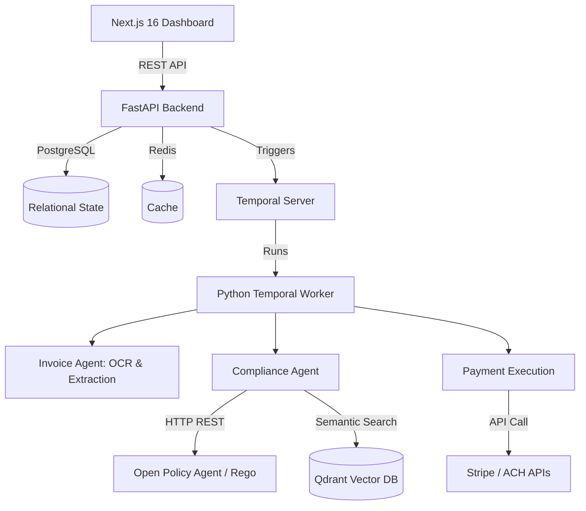

# AFOS: AI Financial Operating System


AFOS is a category-defining **Autonomous Financial Operating System** designed to sit between your ERP, AP automation tools, and bank accounts. 

Unlike traditional finance dashboards or simplistic LLM chatbots, AFOS is a **state-machine driven orchestration platform**. It leverages distributed workflows to allow highly-specialized AI agents to execute real financial transfers autonomously, bounded by hardcoded, deterministic corporate policies.

---

## 🌟 Key Features

* **Zero-Click Accounts Payable**: Invoices are ingested, OCR'd, mapped to vendors semantically, evaluated for risk, and routed for payment automatically.
* **Deterministic Policy Enforcement**: LLMs do not make the final security decisions. Every transaction is passed through a localized **Open Policy Agent (OPA)** engine to enforce hard corporate guardrails (e.g., "Block duplicate payments", "Require human review if >$5000").
* **Multi-Rail Payment Routing**: Depending on the vendor's profile, AFOS dynamically routes approved funds via Stripe Connect, ACH (Modern Treasury), or Virtual Cards (Stripe Issuing).
* **Live Treasury Forecasting**: Analyzes live PostgreSQL burn-rates to dynamically forecast cash runway using historical spend models.
* **Semantic Vendor Intelligence**: Uses Qdrant Vector DB to instantly detect duplicate SaaS subscriptions or shadow IT across all expenses.

---

## 🏗 System Architecture

The platform follows a modern microservices architecture optimized for AI orchestration:



### 🧠 The 4 Core AI Agents

1. **Invoice Agent (`invoice_agent.py`)**: Extracts structured JSON from raw PDF text or images using OCR + GPT-4o-mini. Semantically matches the extracted vendor name to the PostgreSQL DB using Qdrant embeddings.
2. **Compliance Agent (`compliance_agent.py`)**: Evaluates transactions against OPA Rego policies. If a rule triggers a "review" action, the workflow pauses and notifies the Approval Center.
3. **Treasury Agent (`treasury_agent.py`)**: Analyzes historical burn rates, calculates live runway, and predicts future cash flow bottlenecks to generate a 90-day forward-looking forecast.
4. **Expense Agent (`expense_agent.py`)**: Automatically assigns accounting categories (e.g., "Software & SaaS") to raw bank feed data and flags statistical spend anomalies based on historical averages.

---

## 📂 Project Structure

```text
finos/
├── app/                  # Next.js Frontend (React, Tailwind, Framer Motion)
│   ├── (dashboard)/      # Protected dashboard routes (Approvals, Treasury, Analytics)
│   ├── api/              # Next.js API routes (if any)
│   └── globals.css       # Global styling & Tailwind directives
├── backend/              # Python FastAPI + Temporal Backend
│   ├── app/
│   │   ├── activities/   # Temporal Activities (OCR, Compliance Check, Payment Execution)
│   │   ├── agents/       # AI Prompts and LLM routing logic
│   │   ├── api/v1/       # REST API endpoints
│   │   ├── core/         # DB config, Redis client, Qdrant setup, Temporal client
│   │   ├── models/       # SQLAlchemy ORM Models (Postgres)
│   │   └── workflows/    # Temporal Workflow definitions (State machines)
│   ├── main.py           # FastAPI entry point
│   ├── reset_db.py       # Utility to wipe and re-seed the DB
│   └── temporal_worker.py# The Temporal worker process that executes workflows
├── policies/             # OPA Rego policy files
│   └── finance.rego      # Hardcoded financial guardrails
└── docker-compose.yml    # Infrastructure (Postgres, Redis, Qdrant, OPA)
```

---

## 🚀 Getting Started

### Prerequisites
- Node.js 18+
- Python 3.11+
- Docker & Docker Compose
- OpenAI API Key

### 1. Environment Setup

Clone the repository and configure your environment variables. Inside the `backend` folder, create a `.env` file:

```env
OPENAI_API_KEY="sk-your-openai-key"
STRIPE_SECRET_KEY="sk_test_your_stripe_key"
```

### 2. Start Core Infrastructure (Docker)
AFOS relies on PostgreSQL, Redis, Qdrant, and OPA.

```bash
docker-compose up -d
```
*Note: This exposes Postgres (5432), Redis (6379), Qdrant (6333), and OPA (8181).*

### 3. Initialize the Backend & Seed Data
The FastAPI backend serves the dashboard APIs and submits workflows to Temporal.

```bash
cd backend

# Create and activate virtual environment
python -m venv venv
.\venv\Scripts\activate   # Windows
source venv/bin/activate  # Mac/Linux

# Install dependencies
pip install -r requirements.txt

# Reset and seed the database with demo vendors, expenses, and invoices
python reset_db.py

# Start the FastAPI server
uvicorn app.main:app --port 8000 --reload
```

### 4. Start the Temporal Worker
The Temporal worker runs the distributed state machines. It is responsible for orchestrating the agents. Open a **new terminal**:

```bash
cd backend
.\venv\Scripts\activate   # Windows (or Mac/Linux equivalent)

python temporal_worker.py
```

### 5. Start the Next.js Frontend
Finally, start the dashboard. Open a **new terminal**:

```bash
npm install
npm run dev
```

Open your browser to [http://localhost:3000](http://localhost:3000).

---

## 🧪 Testing the Autonomous Workflow

1. Navigate to the **Invoice Center** in the UI and click **Upload/Add Invoice**.
2. Submit a dummy invoice for an amount **greater than $5000**.
3. **The Workflow Begins**: The Temporal Worker instantly extracts the data and queries the **Open Policy Agent (OPA)**.
4. **Policy Enforcement**: Because `finance.rego` dictates that transactions >$5000 require manual review, the workflow is autonomously paused.
5. **Approval**: Navigate to the **Approvals** tab in the UI. You will see the blocked transaction with the AI's explanation. Click **Approve**.
6. **Execution**: The Temporal worker wakes back up and executes a simulated **Multi-Rail Payout** (defaulting to Stripe Connect in test mode).

## 🔐 Open Policy Agent (OPA) Integration
AFOS guarantees safety via Policy-as-Code. All financial guardrails are defined in `policies/finance.rego`. This ensures that even if an LLM hallucinates, it cannot bypass corporate spend limits. Any changes made to `finance.rego` are hot-reloaded by the OPA Docker container!
